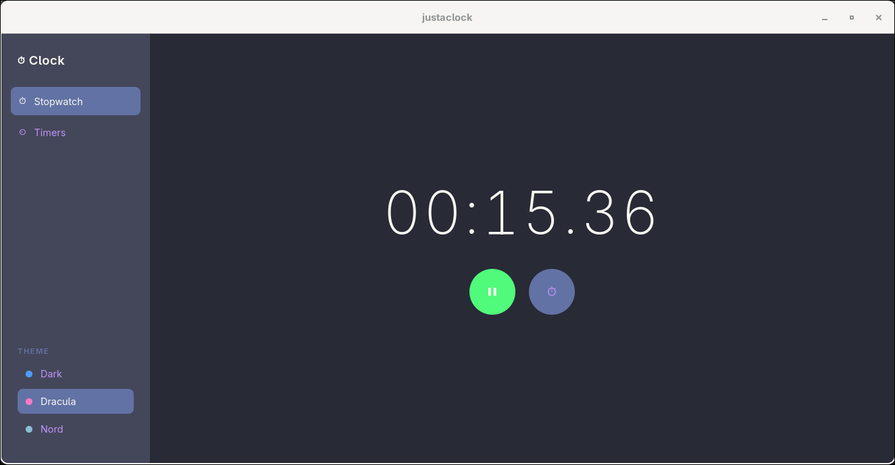
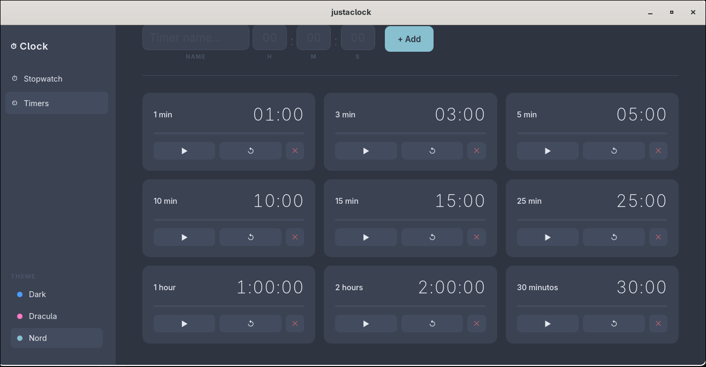

# ⏱ JustAClock

A sleek, native desktop clock application built with **React**, **Tauri**, and **Rust**. Features a stopwatch, countdown timers, and a beautiful dark-themed UI — inspired by the Windows Clock app, but made for Linux.

---

## ✨ Features

- **⏱ Stopwatch** — Precise to the centisecond, with lap tracking and split times
- **⏲ Timers** — Create custom countdown timers with hours, minutes, seconds, and custom names
- **🎨 Themes** — Three beautiful color schemes: Dark, Dracula, and Nord
- **💾 Persistent Storage** — Timers are saved locally and survive app restarts
- **🖥️ Native Desktop App** — Built with Tauri for a lightweight, fast experience
- **🎯 System Integration** — Appears in your app menu, searchable by name

---

## 🖼️ Screenshots

  
  

---

## 🚀 Installation

### Prerequisites

- [Node.js](https://nodejs.org/) & npm
- [Rust](https://www.rust-lang.org/tools/install)
- Arch Linux build tools: `base-devel`, `webkit2gtk-4.1`
sudo pacman -S nodejs npm base-devel webkit2gtk-4.1

### Build from Source
git clone https://github.com/adrielldev/justaclock.git
cd justaclock
npm install
cargo tauri build --no-bundle

### Install System-Wide
chmod +x scripts/install.sh
./scripts/install.sh

This will:
- Build the release binary
- Install it to `/usr/local/bin/justaclock`
- Create a `.desktop` entry for your app menu
- Update the desktop database

### Uninstall
sudo rm /usr/local/bin/justaclock
sudo rm /usr/share/applications/justaclock.desktop
sudo update-desktop-database /usr/share/applications/

---

## 🛠️ Development
npm run tauri dev
cargo tauri build --no-bundle

---

## 🏗️ Tech Stack

| Layer | Technology |
|-------|-----------|
| Frontend | React 19 + TypeScript |
| UI Styling | CSS Variables (theming) |
| Desktop Framework | Tauri v2 |
| Backend | Rust |
| Storage | Tauri Plugin Store (local JSON) |

---

## 📁 Project Structure
justaclock/
├── src/                    # React frontend
│   ├── components/
│   ├── hooks/
│   ├── types/
│   ├── App.tsx
│   └── App.css
├── src-tauri/              # Rust backend
│   └── src/
│       └── main.rs
├── scripts/
│   └── install.sh
├── package.json
├── Cargo.toml
└── README.md

---

## 🤝 Contributing

Contributions are welcome! Feel free to open issues or submit pull requests.

---

## 📄 License

GPL-3.0 © adrieldev